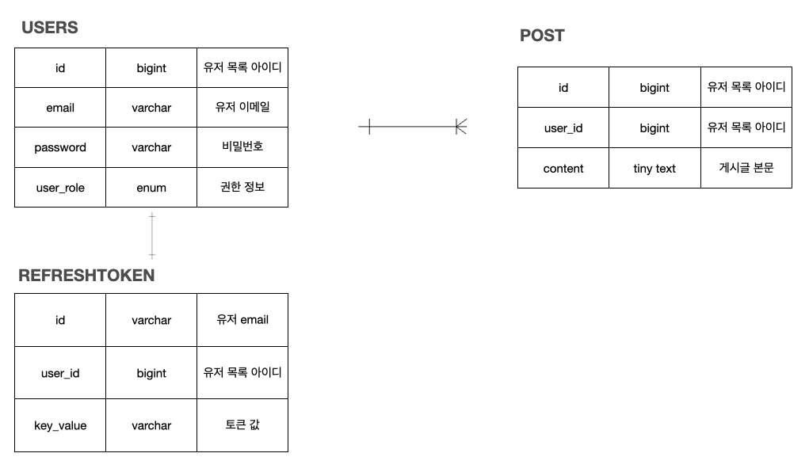

# Pre-Onboarding Backend 사전 과제
>name : 김범석  
>demo 영상 링크 : [영상 바로가기](https://youtu.be/6Hn77CKswpY)

## 애플리케이션 실행 방법

##### 1. MySQL 실행 

해당 루트에서 다음 명령어 실행 

```shell	
docker compose up -d 
```


##### 2. gradle.build 실행

해당 루트에서 다음 명령어 실행 

```shell
./gradlew clean build
```


##### 3. jar 파일 실행 

디렉토리 이동 

```shell
cd build/libs
```

jar 파일 실행 

```shell
java -jar internship-0.0.1-SNAPSHOT.jar
```


## 설계

### ERD



### API 명세서
[index.html](src%2Fmain%2Fresources%2Fstatic%2Fdocs%2Findex.html)

### 구현 방법 및 이유

#### 사용자 회원가입 엔드포인트

> 회원가입의 경우 Controller에서는 단순히 record만을 받아 Service단에게 넘기도록 구현했습니다.
>
> Service 단에서는 1차적으로 Email 요구사항 및 비밀번호 요구사항에 대한 유효성을 검증합니다. 
>
> 2차적으로 Database에 이미 해당 Email로 회원가입 한 회원이 있는지 검증합니다.
>
> 그 후에 회원의 비밀번호의 경우 BCryptPasswordEncoder를 사용해 회원의 비밀번호를 암호화 하여 회원 가입 처리를 진행합니다.
>
> 응답 코드는 201 으로 처리했습니다.

#### 사용자 로그인 엔드포인트

> 로그인의 경우 Controller 단에서는 단순히 record만을 받아 Service단에게 넘기도록 구현했습니다.
>
> Service단에서는 1차적으로 Email 요구사항 및 비밀번호 요구사항에 대한 유효성을 검증합니다. 
>
> 2차적으로 해당 이메일이 데이터베이스 내에 존재하는지 검증합니다. 
>
> 그 후에 가입할 때 적었던 비밀번호와 로그인 시에 기입한 비밀번호가 일치하는 지 검증합니다. 
>
> 모든 검증이 끝난 후 header에 Access Token, Refresh Token을 발급해 주며 204 응답 코드를 사용해 응답했습니다.

#### 새로운 게시글을 생성하는 엔드포인트

> 게시글 생성의 경우 로그인 한 유저만 사용가능하도록 구현했습니다. 
>
> Service 단에서 1차적으로 AccessToken을 받아 Email을 검증한 후에 유저를 가져옵니다.
>
> 그 후에 게시글을 생성한 후에 201 응답 코드를 반환합니다.

#### 게시글 목록을 조회하는 엔드포인트

> 게시글 목록 조회의 경우 별다른 Pagination 인자를 주지 않을 경우를 대비해 `@PageableDefault`을 사용해 기본 페이지네이션을 적용했습니다.
>
> *기본 Pagination : 10개씩, Post id오름차순*
>
> 게시글 목록 조회의 경우 로그인 한 사용자가 아니더라도 이용 가능하도록 구현했습니다. 

#### 특정 게시글을 조회하는 엔드포인트

> 특정 게시글 조회의 경우 postId의 유효성을 검사한 후에 게시글에 관련한 정보를 응답하는 방식으로 구현했습니다.
>
> 특정 게시글 조회의 경우 로그인 한 사용자가 아니더라도 이용 가능하도록 구현했습니다.

#### 특정 게시글을 수정하는 엔드포인트

> 게시글 수정의 경우 1차적으로 postId의 유효성을 검사합니다. 
>
> 그 후 AccessToken의 유효성을 검사한 후에 포함되어 있는 email로 User객체를 가져옵니다.
>
> 마지막으로 Post의 작성자와 요청을 한 사용자가 같은 유저인지 확인을 합니다. 
>
> 그 후 게시글의 내용을 수정하여 업데이트 한 후에 상태코드 200으로 응답했습니다.

#### 특정 게시글을 삭제하는 엔드포인트

> 게시글 삭제의 경우 1차적으로 postId의 유효성을 검사합니다. 
>
> 그 후 AccessToken의 유효성을 검사한 후에 포함되어 있는 email로 User객체를 가져옵니다.
>
> 마지막으로 Post의 작성자와 요청을 한 사용자가 같은 유저인지 확인을 합니다. 
>
> 그 후 게시글을 삭제한 후 상태코드 200으로 응답했습니다.

### API 외 개발 구현 사항 
#### 테스트 코드 작성
> 기능 개발한 코드들의 검증을 위해 Service 및 Controller 코드에 테스트 코드를 추가하였습니다.  
추가적으로 API 명세서 개발을 위해 RestDocs와 Ascii를 사용해 API 명세서를 작성했습니다.

#### Docker compose를 이용한 MySQL 구성 설정 
> 다른 로컬에서도 동일하게 어플리케이션을 사용할 수 있도록 docker compose를 사용했습니다. 

#### 기밀사항 Yaml 분리
> `spring.profiles.include` 기능을 사용해 보안과 관련된 사항들이 포함된 파일들을 분리하여 관리했습니다.  
> **평가자의 로컬에서 동일한 실행을 위해 마지막에 github에 파일이 추적되도록 했습니다.**

